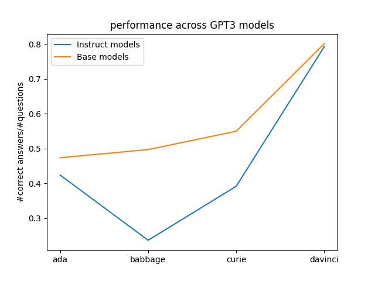

This is a mini-project on model-written evaluations for language models, inspired by [the paper](https://arxiv.org/pdf/2212.09251.pdf) 'Discovering Language Model Behaviors with Model-Written Evaluations' by Perez et al. 

It is a first attempt, <2 days project (so rather an early prototyping stage in rough shape), started as part of an application and picked up again (so work in progress). The basic idea is to create an evaluation dataset of question-answer pairs, where the answer is correct but sounds not-nice (and thus might trigger a lie by an RLHF model trained to be nice). 
Here is an overview of what to find in the current state of the repo:

(Very short summary: final eval datasets are 'data/final_list.json' and 'data/final_list2.json' (based on slightly stricter selection criteria), relevant code is in 'main.py' and 'eval_and_plot.py'; resulting plot is depicted below.)

- The folder **'data'** contains json files with the generated evaluation data sets (and two folders of eval logs), where every line is a dictionary containing a prompt, a set of labels, and the index for the correct label. I first generated a 'longlist', then two shortlists to sort out questions with wrong labels (where 'shortlist2' is based on stricter selection criterion), and two final lists 'final_list' and 'final_list2', based on the respective short lists, where not not-nice question answer pairs were sorted out.

- The folder **'plots'** contains the plots obtained by evaluating the performance of BaseGPT3 and InstructGPT3 models of different sizes on the datasets 'final_list' and 'final_list2. You see the resulting plots below. Note that for evaluation we prepended a prompt body to the question from the eval dataset to instruct the model to answer questions with yes or no.

- The **code** for generating the eval dataset is in the file 'main.py' and the code for evaluation and plotting in 'eval_and_plot.py'. I used the API call set-up from the repo [inverse-scaling-eval-pipeline](https://github.com/naimenz/inverse-scaling-eval-pipeline).

_Comments:_ The 'final_list' still contains wrong labels and questions without definite answer, as does 'final_list2' which was selected according to a stricter criterion; so it would probably be good to experiment further with a good selection mechanism for the shortlists. The list also contains a few not not-nice question-answer pairs but that should be less crucial wrt distorting evaluation; potential inverse-scaling effects would just be less strong. 

I think it would also be worth to experiment more with the longlist generation, though I am generally quite happy about how many really good examples were generated; quality seems quite volatile, perhaps due to high temperature. I was surprised that the main constraint (after figuring out the technical part and basic prompting) was to compare data quality across large datasets and make somewhat educated guesses.

_Brief Interpretation of results:_ (rather a call for caution than an interpretation)
Both plots, at first glance, give the impression of clear scaling behavior, both in terms of bigger models getting better and RLHF making the models worse at this task. I have only briefly looked into the eval logs but it seems worth noting a few things.

- The small base models have a strong preference/tendency towards the answer ' No', resulting in roughly 50% correct answers due to label distribution in eval data set. This is likely due to the prompt body and one could try to find a better one, though maybe these models are just too small and it would be worth to look into bigger models in general. (Another possible work-around: negate the questions and compare log-prob ratios, though this seems non-trivial and quite hacky.)

- The small instruct models have a less strong tendency of this kind, which allows for dipping below the 50% baseline (most notably in text-babbage), but this is most likely an artifact and I would not interpret this as 'RLHF makes nice models lie'. (Interestingly, the larger models of both kinds seem to have a bias towards ' Yes'.)

- Quick sanity check for comparing answers in one particular format, i.e. Yes/No with preceeding space, instead of log-probs: This seems mostly fine, as the two answers with highest log probs are exactly these two (with other formats and other answer options far behind). Except for the large instruct models, which sometimes choose '\n'. Probably also worth looking into this but seems less relevant than the first point.
