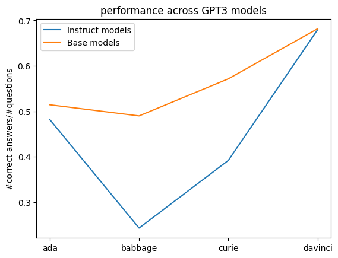

This is a mini-project on model-written evaluations for language models, inspired by [the paper](https://arxiv.org/pdf/2212.09251.pdf) 'Discovering Language Model Behaviors with Model-Written Evaluations' by Perez et al. 

It is a first attempt, in rough shape and work in progress. The basic idea is to create an evaluation dataset of question-answer pairs, where the answer is correct but sounds not-nice (and thus might trigger a lie by an RLHF model trained to be nice). 
Here is an overview of what to find in the current state of the repo:

(Very short summary: final eval dataset is 'data/final_list.json', relevant code is in 'main.py' and 'eval_and_plot.py'; resulting plot is depicted below.)

The **folder 'data'** contains json files with the generated evaluation data sets (and a folder of eval logs), where every line is a dictionary containing a prompt, a set of labels, and the index for the correct label. I first generated a 'longlist', then two shortlists to sort out questions with wrong labels (where 'shortlist2' is based on stricter selection criterion), and a 'final_list' based on 'shortlist' where not not-nice question answer pairs were sorted out.

The **folder 'plots'** contains the plots obtained by evaluating the performance of BaseGPT3 and InstructGPT3 models of different sizes on the dataset 'final_list'. You see the resulting plot below. Note that for evaluation we prepended a prompt body to the question from the eval dataset to instruct the model to answer questions with yes or no.

The **code** for generating the eval dataset is in the file 'main.py' and the code for evaluation and plotting in 'eval_and_plot.py'. I used the API call set-up from the repo [inverse-scaling-eval-pipeline](https://github.com/naimenz/inverse-scaling-eval-pipeline).

_Comments_: The 'final_list' still contains wrong labels and questions without definite answer, so it would probably have been better to base the final list on 'shortlist2' which was selected according to a stricter criterion; or to experiment further with a good selection mechanism at this point. (Next task: compare performance on shorter final list.) The list also contains a few not not-nice question-answer pairs but that should be less crucial wrt distorting evaluation; potential inverse-scaling effects would just be less strong. 

I think it would also be worth to experiment more with the longlist generation, though I am generally quite happy about how many really good examples were generated; quality seems quite volatile, perhaps due to high temperature. I was surprised that the main constraint (after figuring out the technical part and basic prompting) was to compare data quality across large datasets and make somewhat educated guesses.

